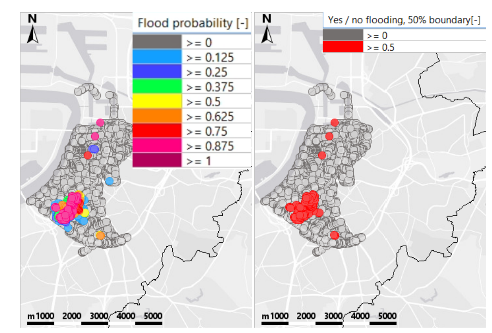
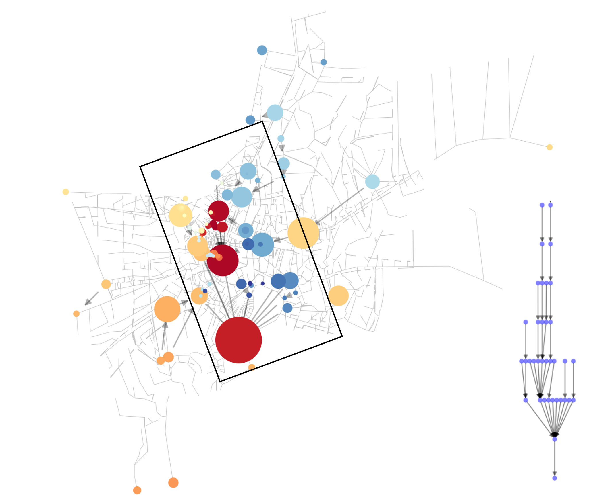

.. _use_cases:

Use cases
=========

Operational rainfall and flood nowcasting for the city of Antwerp
-----------------------------------------------------------------

A pilot study of using the hybrid model in operational flood nowcasting has been carried out by M. Radema (mees.radema@deltares.nl) in 2023. 
This project encompasses a pilot study regarding the integration of a rainfall nowcasting algorithm (pysteps) and a short-term urban flood forecasting model (hybridurb) in the software package Delft-FEWS, working towards real-time high-resolution flood forecasts in an urban setting. 
Below is a snapshot showing the urban flood nowcasting system.

Urban drinage network analysis using graph-theory
-------------------------------------------------

A pilot study of using the graph-theory network analysis module for bangkok has been carried out by X. Li (xiaohan.li@deltares.nl) in 2021. 
This project examines the flow path/diagram in the network and gains understanding of the network. 
Below is a plot shows that by aggregating the outlets' and pumps' upstream area, the drainage pattern in the system is identified as a tree diagram.  

